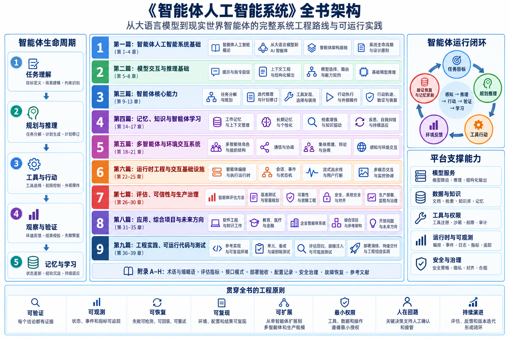

# 智能体人工智能系统：从大语言模型到现实世界智能体

## 全书导览

本书是一份面向研究生、工程师和技术管理者的智能体人工智能系统指南。内容从模型交互、规划和工具调用，逐步推进到多智能体、运行时、评估治理以及可运行工程实践。

*从模型交互、规划与行动，到运行时、治理和可运行工程实践的完整路线。*

> 当前仓库提供书稿的中文写作骨架。章节正文、图表、实验和代码将由六位作者按任务卡持续补充。

## 阅读路径

- **基础路径：** 第一篇至第三篇，建立概念、模型交互、规划和行动能力。
- **系统路径：** 第四篇至第六篇，学习状态、记忆、多智能体和运行时。
- **生产路径：** 第七篇至第九篇，完成评估、安全、治理、测试和部署演练。
- **项目路径：** 第八篇 Ch34 与第九篇配套的参考实现，适合课程或团队实训。

## 书稿状态

| 项目 | 状态 |
| --- | --- |
| 目录 | 九篇、39章已冻结 |
| 中文稿 | 按章节任务卡编写中 |
| 英文稿 | 中文冻结后批量翻译 |
| 计划提交 | 2026年11月30日 Springer |
